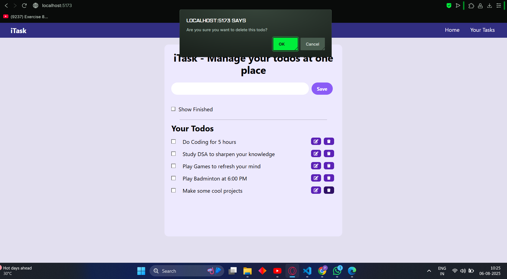
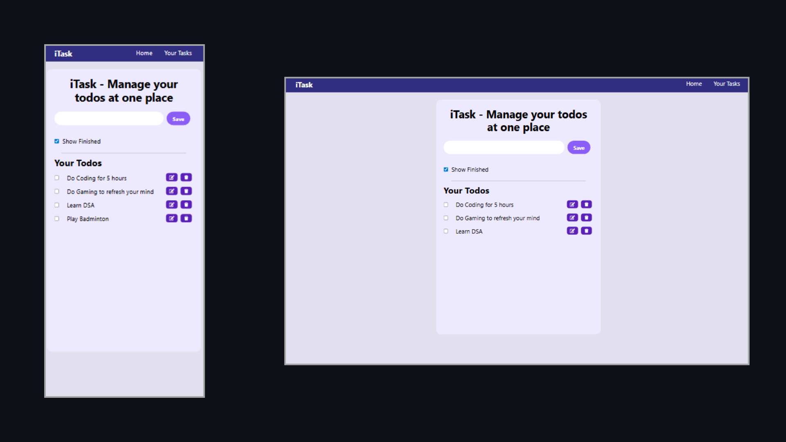

# 📝 iTask - Manage Your Todos at One Place
iTask is a simple yet elegant React-based Todo Manager where you can create, edit, delete, and mark tasks as completed. It also remembers your todos using Local Storage, so they persist even after refreshing the page.

## 🚀 Features
✅ Add new todos

📝 Edit existing todos

❌ Delete todos with confirmation prompt

☑️ Mark todos as completed

🔄 Toggle visibility of completed todos

💾 Persistent storage with localStorage

📱 Responsive design for all screen sizes

## 🛠️ Tech Stack
React (Functional Components + Hooks)

- Tailwind CSS for styling

- UUID for unique todo IDs

- React Icons for beautiful buttons

### 📸 Preview

## 🔧 Future Improvements
- Add due dates and reminders

- Use a database (like MongoDB) for storing todos

- User authentication

- Dark mode toggle

- Drag and drop reordering

🤝 Contributing
Contributions are welcome! Fork the repo and open a pull request. Feel free to open issues for suggestions or bugs.
